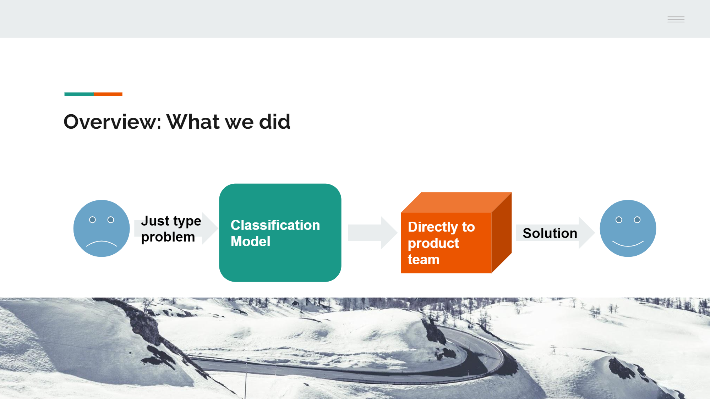

# IBM-Consumer-Complaint-Classification-Modeling
+ **Team Members**
  + Young Sim
  + Ruowang Li
  + Yuchen Xu
  + Xian Qu
  
Only individual work on LSTM model has been included in this repository. Full analysis of the project including results from additional models can be found in presentation slides.

+ **Objectives**: The goal of this project is to build a classification model that can triage complaint narratives on consumer financial products to departments in charge. The model contributes to simplification of complaint submission process.

+ **Summary**: In this project, we conducted natural language processing and classification modeling using Consumer Complaint Database in collaboration with IBM. As seen below, the complaint narratives are submitted by consumers through a form that require many steps. The purpose of the project is to save clients from tedious trouble-shooting forms and improve user experience.
  
  
  
  

  Thus for the purpose of our model, we only used complaint narratives as features and sub-product category as target.

  

  The number of complaints per the 47 sub-product categories is imbalanced. So we used weighted F1 score in addition to accuracy for evaluation.

  
  
  To train LSTM with open source pre-trained word vectors (fasttext provided by Facebook) implemented, we first tokenize and lemmatize narratives, and fit the model on the processed data. Weights for words not included in the pre-trained vectors were set to zero. With 3 epochs trained, the model achieved accuracy of 74% and weighted F1 of 72%. More than 50% of the the words from our data were not included in the pretrained data. That is, The model achieved the performance with less than 50% of the data. So there is a big room to grow with some modifications, such as using other pretrained data that works better for our purpose.
  
  + Future works for improvements:
    + Provide more training for LSTM model
    + Find other pre-trained data that works better for our purpose
    + Imbalanced data: apply techniques like oversampling / SMOTE
    + Automate updates for obsolete data and retraining
    + Update categories by issues/sub-issues


+ **Contributions**:
  + Collaborated with IBM to conduct Natural Language Processing project using Consumer Complaint Database as class group project. The model contributed to simplification of the complaint submission process for consumer financial products by classifying comments by product category.
  +	Cleaned and preprocessed text data using nltk module and pretrained FastText word vectors.
  +	Built a bidirectional LSTM model in Python and achieved accuracy of 74% and weighted average of f1 of 72%, classifying submission issues into 47 categories.
  +	Presented purpose, results, and suggestions for improvement of the project to convey business value of the model.


+ **Keywords: Classification, Prediction Modeling, Natural Language Processing, Deep Learning, LSTM, Python**


Following [suggestions](http://nicercode.github.io/blog/2013-04-05-projects/) by [RICH FITZJOHN](http://nicercode.github.io/about/#Team) (@richfitz). This folder is orgarnized as follows.

```
proj/
├── data/ data used in the analysis. 
├── doc/ report, presentation files, and final deliverables.
├── figs/ figures.
└──  lib/ notebooks for preprocessing.
```

Please see each subfolder for a README file.
